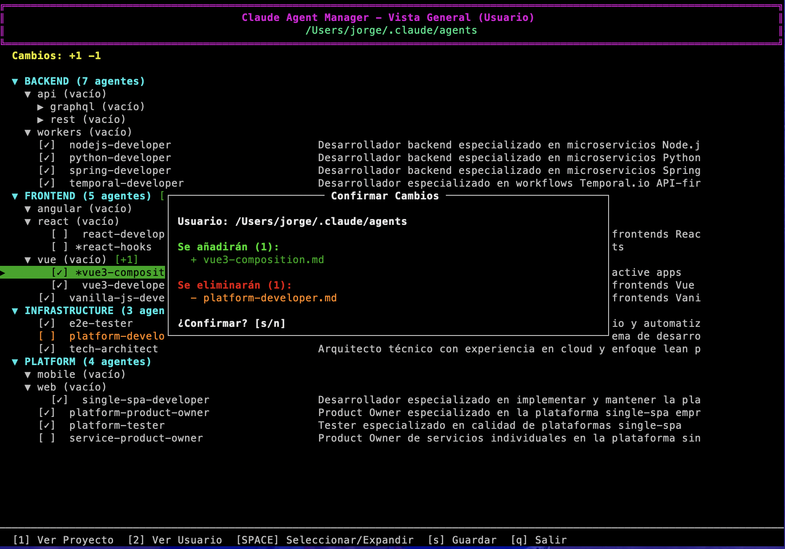

# Claude Agent Manager

Gestor de agentes especializados para Claude Code.



## Instalación

### Opción 1: Script de instalación (recomendado)
```bash
git clone https://github.com/GailenTech/claude-agent-manager.git
cd claude-agent-manager
./install.sh
```

El instalador:
- Añade `agent-manager` al PATH del sistema
- Instala en `/usr/local/bin` (sistema) o `~/.local/bin` (usuario)
- Copia la colección de agentes a una ubicación centralizada
- Configura todo automáticamente

### Opción 2: Binario precompilado (recomendado para usuarios finales)
Descarga directamente desde GitHub Releases - no requiere Python instalado:

```bash
# macOS Intel
curl -L https://github.com/GailenTech/claude-agent-manager/releases/latest/download/agent-manager-macos-x86_64.tar.gz | tar -xz
sudo mv agent-manager-macos-x86_64 /usr/local/bin/agent-manager

# macOS Apple Silicon (M1/M2/M3/M4)
curl -L https://github.com/GailenTech/claude-agent-manager/releases/latest/download/agent-manager-macos-arm64.tar.gz | tar -xz
sudo mv agent-manager-macos-arm64 /usr/local/bin/agent-manager

# Linux x86_64
curl -L https://github.com/GailenTech/claude-agent-manager/releases/latest/download/agent-manager-linux-x86_64.tar.gz | tar -xz
sudo mv agent-manager-linux-x86_64 /usr/local/bin/agent-manager
```

### Opción 3: Compilar binario localmente
Si prefieres compilar tu propio ejecutable:

```bash
# Generar binario con PyInstaller
./build-binary.sh

# O generar binario optimizado con Nuitka (más rápido, más pequeño)
./build-binary-nuitka.sh

# Instalar el binario
sudo cp dist/agent-manager-* /usr/local/bin/agent-manager
```

## Uso

```bash
agent-manager
```

### Controles
- `↑/↓` Navegar
- `→/←` Expandir/Colapsar carpetas
- `SPACE` Seleccionar agente o expandir/colapsar carpeta
- `1` Vista Proyecto
- `2` Vista Usuario
- `g` Gestión de Fuentes (nuevo)
- `v` Ver contenido del agente
- `s` Guardar cambios
- `q` Salir

#### Gestión de Fuentes
- `↑/↓` Navegar entre fuentes
- `SPACE` Activar/desactivar fuente
- `u` Actualizar/sincronizar fuentes
- `d` Eliminar fuente
- `ESC` Volver a vista principal

### Características
- **Estructura de árbol**: Navega por categorías y subcarpetas de agentes
- **Dos niveles de instalación**: Usuario (`~/.claude/agents`) or Proyecto (`.claude/agents`)
- **Sistema de fuentes extensible**: Gestiona múltiples repositorios de agentes
- **Sincronización automática**: Actualiza colecciones desde Git, directorios locales, o URLs
- **Sistema de prioridades**: Resuelve conflictos entre fuentes automáticamente
- **Seguimiento de cambios**: Visualiza qué se añadirá (+) o eliminará (-) antes de guardar
- **Códigos de color**: Azul para Usuario, Verde para Proyecto, Cian para Fuentes
- **Vista previa**: Lee el contenido de los agentes antes de instalarlos

### Sistema de Fuentes

El Agent Manager incluye un sistema de fuentes extensible que permite:

#### Fuente por defecto
- **Repositorio oficial**: `https://github.com/GailenTech/claude-agent-manager.git`
- Se instala automáticamente con prioridad alta (100)
- Contiene agentes especializados para desarrollo

#### Agregar fuentes personalizadas
```bash
# Mediante la UI: presiona 'g' -> 'a' y sigue las instrucciones
# O editando manualmente: ~/.config/claude-agent-manager/sources.json
```

#### Tipos de fuentes soportados
- **Git**: Repositorios públicos/privados con actualización automática
- **Local**: Directorios en el sistema de archivos local
- **HTTP**: URLs de archivos ZIP/tar.gz (próximamente)

#### Sincronización automática
- **Al inicio**: Comprueba si han pasado más de 24 horas desde la última sincronización
- **Primera vez**: Si nunca se ha sincronizado, descarga automáticamente en segundo plano
- **Intervalo configurable**: Por defecto cada 24 horas (86400 segundos)
- **No bloquea la UI**: La sincronización ocurre en segundo plano
- **Indicador visual**: Muestra "🔄 Sincronizando fuentes..." cuando está en proceso

#### Configuración persistente
- **Config**: `~/.config/claude-agent-manager/sources.json`
- **Cache**: `~/.cache/claude-agent-manager/sources/`
- **Auto-sync**: Se puede desactivar poniendo `"auto_sync": false` en el config
- **Intervalo personalizable**: Cambiar `"sync_interval"` (en segundos)
- Cada fuente tiene su propia carpeta de cache con actualizaciones incrementales

## Desinstalar

```bash
./uninstall.sh
```

## Desarrollo

### Estructura del proyecto
```
claude-agent-manager/
├── agent-manager                # Script principal
├── agents-collection/          # Colección de agentes organizados por categoría
│   ├── platform/
│   ├── frontend/
│   ├── backend/
│   └── infrastructure/
├── install.sh                  # Instalador
├── uninstall.sh               # Desinstalador
├── build-binary.sh            # Generador de binario con PyInstaller
├── build-binary-nuitka.sh     # Generador de binario optimizado con Nuitka
└── .github/workflows/release.yml # CI/CD para generar releases automáticos
```

### Releases automáticos
Los binarios se generan automáticamente con cada tag de versión:
- Cuando se crea un tag `v*` (ej: `v1.0.0`), GitHub Actions compila binarios para todas las plataformas
- Los releases incluyen checksums SHA256 para verificación
- Disponibles para descarga inmediata en la sección Releases

## Licencia

© GailenTech - Todos los derechos reservados