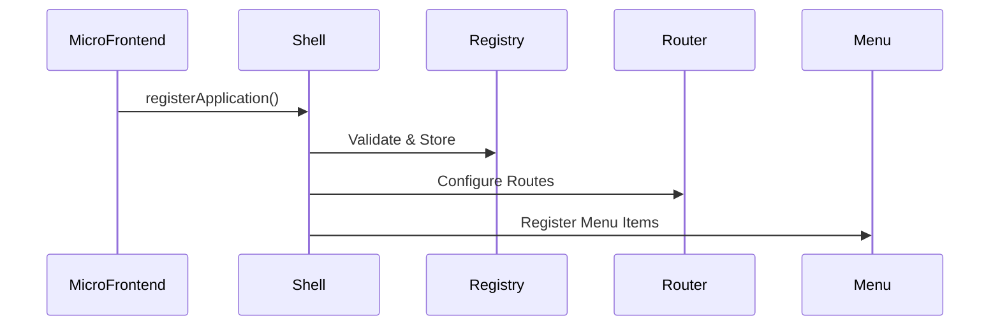
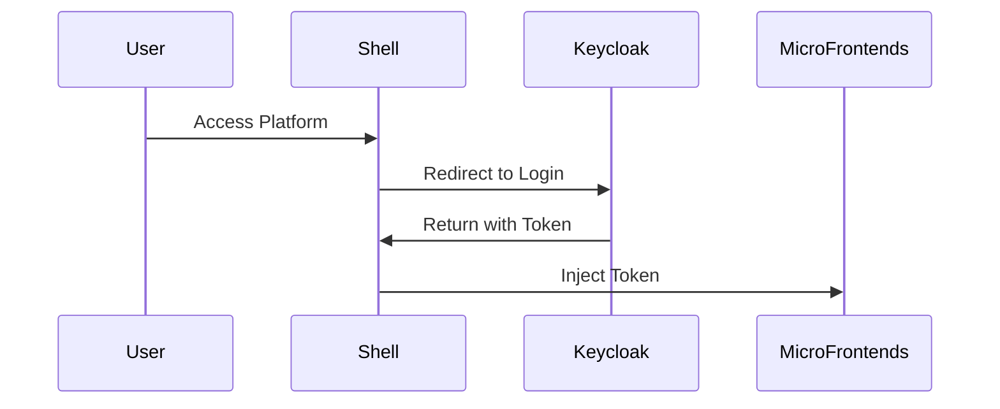

# Arquitectura de la Plataforma Single-SPA

## Visión General

La plataforma está diseñada como un ecosistema de micro-frontends y microservicios que permite desarrollo independiente mientras mantiene una experiencia de usuario cohesiva.

## Componentes Principales

### 1. Shell Application
- **Responsabilidad**: Orquestación de micro-frontends
- **Tecnología**: TypeScript, single-spa
- **Características**:
  - Autenticación OAuth2/Keycloak
  - Sistema de menús dinámicos
  - Event bus para comunicación
  - Registro de aplicaciones

### 2. Micro-Frontends
- **VanillaJS App**: Ejemplo de implementación sin framework
- **Vue3 App**: Aplicación reactiva con Composition API
- **React App**: Aplicación con hooks y patterns modernos

### 3. Backend Services
- **API Gateway**: Punto de entrada unificado
- **Auth Service**: Gestión de autenticación y autorización
- **Business Services**: Servicios específicos por dominio
- **Temporal Workers**: Procesamiento de workflows

### 4. Infraestructura
- **Keycloak**: Identity provider
- **PostgreSQL**: Base de datos multi-tenant
- **Redis**: Cache y pub/sub
- **Temporal**: Orquestación de workflows

## Flujos de Integración

### Registro de Aplicaciones

### Autenticación

## Principios de Diseño

1. **Independencia**: Cada aplicación puede desarrollarse y desplegarse independientemente
2. **Integración**: Comunicación a través de contratos bien definidos
3. **Seguridad**: Multi-tenant con aislamiento completo
4. **Performance**: Lazy loading y optimización de recursos
5. **Observabilidad**: Monitoreo y trazabilidad end-to-end

## Decisiones Técnicas Clave

- **Module Federation**: Para compartir dependencias comunes
- **Import Maps**: Gestión de versiones de librerías
- **Event-Driven**: Comunicación asíncrona entre servicios
- **API-First**: Todos los servicios exponen APIs REST
- **GitOps**: Infraestructura como código